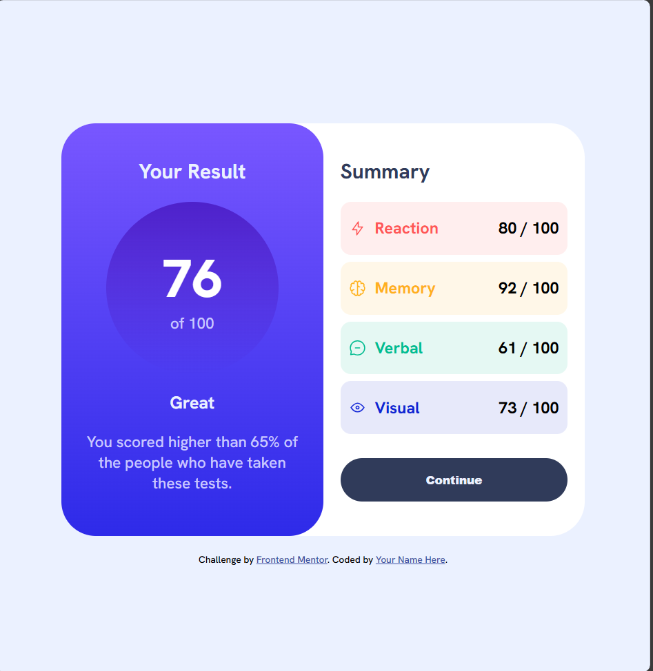

# Frontend Mentor - Results summary component solution

This is a solution to the [Results summary component challenge on Frontend Mentor](https://www.frontendmentor.io/challenges/results-summary-component-CE_K6s0maV). Frontend Mentor challenges help you improve your coding skills by building realistic projects.

## Table of contents

- [Overview](#overview)
  - [The challenge](#the-challenge)
  - [Screenshot](#screenshot)
  - [Links](#links)
- [My process](#my-process)
  - [Built with](#built-with)
- [Author](#author)

**Note: Delete this note and update the table of contents based on what sections you keep.**

## Overview

### The challenge

Users should be able to:

- View the optimal layout for the interface depending on their device's screen size
- See hover and focus states for all interactive elements on the page
- **Bonus**: Use the local JSON data to dynamically populate the content

### Screenshot

### Links

- Solution URL: [Solution URL](https://github.com/scyflix/results-summary-component-main)
- Live Site URL: [Live site URL](https://scyflix.github.io/results-summary-component-main/)

## My process

### Built with

- Semantic HTML5 markup
- CSS variables
- Flexbox
- CSS Grid

## Author

- Website - [Abdulroqib Oladipo](https://scyflix.github.io/Abdulroqib-Portfolio/)
- Frontend Mentor - [@scyflix](https://www.frontendmentor.io/profile/scyflix)
- Twitter - [@abdulroqib123](https://x.com/abdulroqib123)
